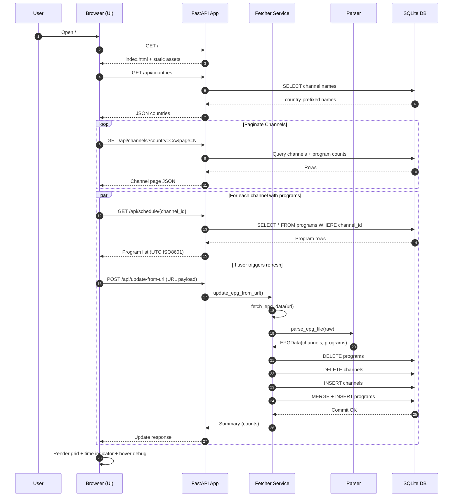

# EPG Web Service Architecture & Data Flow

## Overview
This document explains the end-to-end flow of the Electronic Program Guide (EPG) web service, including data ingestion, normalization, storage, API exposure, and client-side rendering. It also covers the merging logic for consecutive identical programs and how overlapping schedule data is handled.

## High-Level Components
- **FastAPI Application (`src/epg_web/main.py`)**: Bootstraps the app, mounts static assets, templates, and registers API routes.
- **API Layer (`src/epg_web/api/routes.py`)**: Provides endpoints for updating/importing EPG data, listing countries/channels, and retrieving channel schedules.
- **Fetch & Import Service (`src/epg_web/services/fetcher.py`)**: Fetches remote XMLTV/JSON, parses it, clears prior data, merges consecutive program fragments, and persists normalized records.
- **Parser (`src/epg_web/epg/parser.py`)**: Detects XML vs JSON, extracts channels & programs, normalizes times to UTC-naive datetimes.
- **Database Layer (`src/epg_web/models/db.py`, `src/epg_web/services/storage.py`)**: Async SQLite (aiosqlite) models & session factory. Tables: `channels`, `programs`.
- **Schemas (`src/epg_web/models/schemas.py`)**: Pydantic models for both parsed ingestion payloads and API responses.
- **Frontend (`templates/index.html`, `static/js/app.js`, `static/css/style.css`)**: Single-page grid view (pure JS) that fetches channel metadata + full schedules and renders an interactive, horizontally scrollable time grid.
- **Utility Scripts (`scripts/`)**: Operational introspection: overlap detection, channel inspection, extraction, initialization.

## Sequence Diagram (End-to-End)


## Data Ingestion & Normalization
1. **Fetch**: `fetch_epg_data()` downloads remote XMLTV or JSON.
2. **Parse**: `parse_epg_file()` attempts XML (`xmltodict`), falls back to JSON:
   - Channels: `ChannelCreate` list with `name`, string `channel_id`, optional `icon_url`.
   - Programs: `ProgramCreate` list with title, description, category, start/end times.
3. **Time Handling**:
   - XMLTV times like `YYYYMMDDHHMMSS +HHMM` → parsed with offset → converted to UTC → stored as *naive* UTC datetimes.
   - JSON ISO times parsed via `datetime.fromisoformat()` (assumed already UTC or convertible).
4. **Persistence**:
   - Existing rows are dropped (`DELETE` all `Program` then `Channel`).
   - Channels inserted; mapping preserved by cleaned string `channel_id`.
   - Programs grouped and merged before insertion (see below).

## Consecutive Program Merge Logic
Located in `update_epg_from_url()`:
- Programs grouped by channel; each channel's list sorted by `start_time`.
- A new program fragment is merged into the previous one if:
  - `title.strip()` matches
  - `description.strip()` matches (both empty/None are treated equally)
  - `category.strip()` matches
  - `prog.start_time <= last.end_time` (touching or overlapping)
- On merge, `last.end_time` is extended to the max of the two.
- Count of merges is accumulated for reporting.

**Purpose**: Collapses artificial splits (e.g., one long movie or continuous broadcast broken into multiple adjacent entries) to improve UI readability and prevent visual fragmentation.

## Overlapping Programs (Parallel Tracks)
Some channels legitimately contain overlapping entries (e.g., news inserts vs. continuous programming). These are **not** merged if titles/desc/category differ. They remain distinct rows in the DB. The frontend:
- Sorts by start time.
- Uses a moving `cursor` to insert gap blocks.
- Clips overlapping segments so only non-negative visible durations are rendered sequentially in one horizontal lane (rather than stacking visually).

## API Contract Summary
| Endpoint | Purpose | Notes |
|----------|---------|-------|
| `GET /api/countries` | Derive distinct 2-letter country codes from channel names (`CC|`) | Purely derived metadata |
| `GET /api/channels?country=CA&page=1&per_page=50` | Paginated channel list + program counts | Filters by name prefix |
| `GET /api/schedule/{channel_id}` | Full ordered program list for one channel | Emits UTC ISO8601 (`Z`) |
| `POST /api/update-from-url` | Fetch & import remote EPG source | Returns import statistics |
| `POST /api/upload` | (Stub) Parse uploaded file | Persistence intentionally not implemented |

## Frontend Rendering Pipeline
1. Determine a 12-hour viewing window (starts ~1 hour in the past, rounded to :00/:30).
2. Fetch countries → user selects (persisted in `localStorage`).
3. Fetch all channel pages (loop until all pages consumed). Store in `state.allChannelsWithPrograms`.
4. For channels with `program_count > 0`, fetch full schedule; attach programs.
5. Render grid:
   - Build time header in 15-minute slots.
   - For each channel:
     - Filter programs overlapping the window.
     - Insert gap blocks between the moving cursor and next program start.
     - Compute width per program: `(duration_minutes / 15) * 100px`.
     - Clip overlaps by advancing cursor to `max(cursor, program_end)`.
6. Display current time indicator (red vertical line) if inside window; update every minute.
7. Favorites, hide-empty, and favorites-only filters applied client-side.
8. Hovering channel label shows raw JSON in a draggable/pinnable panel.

## Timezones & Serialization
- Internal storage: naive UTC datetimes.
- API serialization: always coerced to UTC with `Z` suffix.
- Frontend: converts to local time using `Date` object and `toLocaleTimeString` for display.
- Debug extraction script optionally adds human-readable EST annotations (for investigative workflows).

## Scripts (Operational & Debug)
| Script | Purpose |
|--------|---------|
| `scripts/init_db.py` | Rebuild DB and pull the latest EPG from default URL |
| `scripts/show_channel_by_id.py` | Inspect a channel's programs + overlap summary |
| `scripts/check_overlaps.py` | Global scan for overlapping program intervals per channel |
| `scripts/search_program_title.py` | Find programs by substring (optional channel filter) |
| `scripts/extract_channel.py` | Fetch raw feed, isolate one channel + its programs, pretty-print with optional EST comments |

## Key Design Decisions
- **Naive UTC storage** simplifies math & avoids accidental local timezone shifts.
- **Merge scope intentionally narrow** (exact title/desc/category match) to minimize false positives.
- **Client-driven windowing** avoids server-side time slicing complexity; all schedule data for a channel is fetched once.
- **Sticky table layout** chosen over CSS grid for reliable cross-browser scroll + sticky intersection behavior.

## Potential Future Enhancements
- Multi-lane rendering for genuine overlaps (parallel tracks) instead of single-lane clipping.
- Incremental / delta updates instead of full table truncation.
- Caching layer (e.g., Redis) for high-traffic country/channel queries.
- Optional server-side time window filtering to reduce payload size for channels with very large histories.
- WebSocket push for live schedule updates.

## Quick Reference (Dev)
```bash
# Initialize / import
python scripts/init_db.py

# Run server (dev)
uvicorn epg_web.main:app --host 0.0.0.0 --port 8000 --reload --log-level warning

# Update from alt URL via API (example JSON body)
curl -X POST http://localhost:8000/api/update-from-url \
  -H 'Content-Type: application/json' \
  -d '{"url": "http://example.com/epg.xml"}'
```

---
Generated on: {{DATE}}
